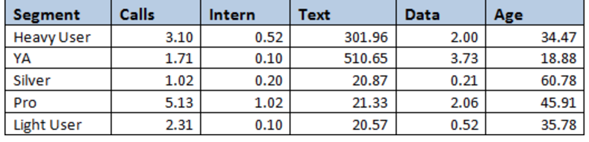

## Quiz Module 2

```{r setup,eval=F,echo=F}
setwd("/Users/saulgarcia/Dropbox/MOOCS/Business Analytics Specialization/Intro_Strategic_Business_Analysis/W1/Quiz2")
list.files()
```

```{r cars,message=FALSE,warning=FALSE}
library(dplyr)
library(ggplot2)
library(statsr)
library(stats)
```


1. What is the correct mean and median of the coefficient of variations of the sales in the SKU dataset (DATA_2.01_SKU.csv)?

```{r, comment=NA}
data = read.csv("../Data/DATA_2.01_SKU.csv")
avg = mean(data$CV)
med = median(data$CV)

paste("The mean is:", avg, "and the median is:", med)
```


2. Do a hierarchical clustering on scaled data using an Euclidian distance and Ward.D clustering on the SKU dataset (DATA_2.01_SKU.csv). What are the resulting segments compared to what is shown in class if you decide to take only 2 clusters?

```{r}
# Clustering
testdata=data 
testdata = scale(testdata) 

d = dist(testdata, method = "euclidean") 
hcward = hclust(d, method="ward.D") 
data$groups<-cutree(hcward,k=2) # 2 clusters or segments 


# Plotting
ggplot(data, aes(x =CV ,y =ADS, col=as.factor(groups))) + geom_point() + theme_classic()
```

**The segments “Crickets” and “Wild Bulls” are merged**

3. Which of the following graphs reports the correct plot of the last project evaluation as a function of the number of projects done for the HR dataset (DATA_2.02_HR.csv)? 
Note that the color or exact representation may be different in your version.

```{r, comment=NA}
data = read.csv("../Data/DATA_2.02_HR.csv")
# LPE = Last Project Evaluation
# NP = Number of Prijects
# LPE as a function of NP    x = LPE  y = NP

ggplot(data, aes(x =LPE ,y =NP)) + geom_point(pch=1) + theme_classic()
```

4. If you cluster the HR dataset (DATA_2.02_HR.csv) on Satisfaction, Project Evaluation and Number of Projects Done and that you keep 2 segments using the same values for the other specifications (scaling, distance type and clustering algorithm), what’s the resulting median Satisfaction per segment? 
Result of the aggregation and median Satisfaction by segment :
(The values in the table are rounded.)

```{r}
# Clustering
testdata=data[,1:3] 
testdata = scale(testdata) 

d = dist(testdata, method = "euclidean") 
hcward = hclust(d, method="ward.D") 
data$groups<-cutree(hcward,k=2) 

(aggdata = aggregate(.~ groups, data=data, FUN=median))

aggdata$S
```

5. For the Telecom dataset (DATA_2.03_Telco.csv), using the specifications of the example presented in the videos, which of the following claim is correct? Use the table below for the naming convention of the segments.(Multiple answers)



* The Young Adult (YA) segment uses more data and text than any other segment

* All the customers in the sample made at least one international call