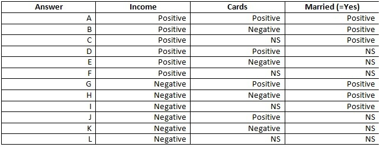
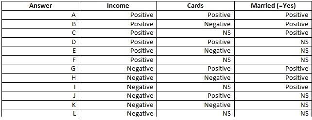
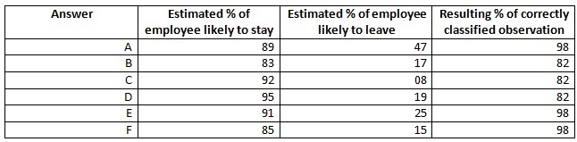
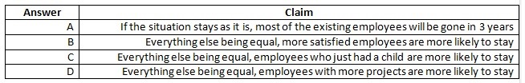

## Quiz Module 2

```{r setup,eval=F,echo=F}
setwd("/Users/saulgarcia/Dropbox/MOOCS/Business Analytics Specialization/Intro_Strategic_Business_Analysis/W2/Q3")
list.files()
```

```{r cars,message=FALSE,warning=FALSE}
library(dplyr)
library(ggplot2)
library(statsr)
library(stats)
library(knitr)
```


1. For the Credit Scoring dataset (DATA_3.01_CREDIT.csv): using the same specifications as the examples covered during the videos, which of the following claims is correct? (You can select multiple answers.)

```{r, comment=NA}
# Read Data
data=read.table('../Data/DATA_3.01_CREDIT.csv',sep=',',header=TRUE)

# Linear Regression
linreg=lm(Rating~.,data=data)
index = (summary(linreg))$coefficients[,4]<.05

# Show only the significant variables with pvalue < 0.05
summary(linreg)$coefficients[index,]
```

**Answer**

* The variable balance has a positive impact on the rating, everything else being equal

* Students have, everything else being equal, a weaker rating

* People with larger income have, everything else being equal, a better rating


2. For the Credit Scoring dataset (DATA_3.01_CREDIT.csv): if you estimate a linear regression of the credit score (Rating) with all the variables included in the dataset, i.e. the same specifications as used in the videos. What is the resulting estimated effect for the variables Income, Cards and Married?



With:

· **Positive** : as the variable increases, the expected credit score increases

· **Negative**: as the variable increases, the expected credit score decreases

· **NS**: the variable has no significant effect on the expected credit score. We consider an effect to be significant when the p-value is smaller than 0.05.

```{r}
names = c("Income","Cards","MarriedYes")
summary(linreg)$coefficients[names,]

```

**Answer**

**F**: Positive, NS, NS

3. For the Credit Scoring dataset (DATA_3.01_CREDIT.csv): if you estimate a linear regression of the credit score (Rating) as a function of the variables Income, Cards and Married, what is the result of the estimation?



```{r, comment = NA}
fit2 = lm(Rating~ Income +  Cards +  Married, data=data)
summary(fit2)
```
Now the variable `Cards` becomes significant.

**Answer** 

**D** POSITIVE, POSITIVE, NS


4. For the HR dataset (DATA_3.02_HR2.csv), adapt the code of the R script to change the cutoff so that an employee with a probability of leaving larger than .5 will be seen as likely to leave. Which one of the following is the resulting output?


```{r,eval=T}
# Load Data
datatot=read.table('../Data/DATA_3.02_HR2.csv', header = T,sep=',')

# Generalized Linear Model: Estimate the drivers of attrition
logreg = glm(left ~ ., family=binomial(logit), data=datatot) 

summary(logreg)

cutoff=.5 #

# Percentage of correctly classified employees who stayed
a = sum((logreg$fitted.values<=cutoff)&(datatot$left==0))/sum(datatot$left==0) 

# Compute the percentage of correctly classified employees who left
b = sum((logreg$fitted.values>cutoff)&(datatot$left==1))/sum(datatot$left==1) 

# Compute the overall percentage of correctly classified employees
c = mean((logreg$fitted.values>cutoff)==(datatot$left==1)) 

kable(data.frame("LikelyStay"=a, "LikelyLeave" = b, "CorrectlyClassified" = c))
```

**Answer**

**D**

5. For the HR dataset (DATA_3.02_HR2.csv), using the same specifications as seen during the videos, which of the following claims is correct? (You can select multiple answers.)



**Answer**
**D**: Everything else being equal, employees with more projects are more likely to stay.