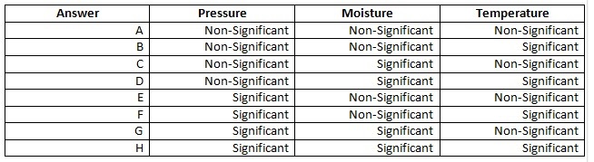
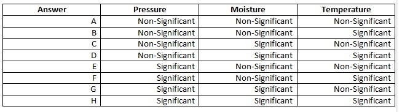

## Quiz 5

```{r setup,eval=F,echo=F}
setwd("/Users/saulgarcia/Dropbox/MOOCS/Strategic-Business-Analytics/01_Intro_Strategic_Business_Analysis/W3/Quiz")
list.files()
```


```{r,message=FALSE,warning=FALSE}
library(dplyr)
library(ggplot2)
library(statsr)
library(stats)
library(knitr)
```

1. For the HR datasets (DATA_3.02_HR2.csv & DATA_4.02_HR3.csv), using the same specifications as seen during the videos, what is the ID of the employee that is the less likely to leave according to the estimated model?

```{r}
# Read Data
train= read.table('../Data/DATA_3.02_HR2.csv',sep=',',header=TRUE)
test = read.table('../Data/DATA_4.02_HR3.csv', sep=',', header = TRUE)

# GLM of Rating as a function of everything else.
logreg = glm(left ~ ., family=binomial(logit), data = train) 
probaToLeave = predict(logreg, newdata=test ,type="response") 

# Make it DF
predattrition= data.frame(probaToLeave)
# Append Performance
predattrition$performance=test$LPE

# Less likely to leave
which.min(predattrition[,1])
```


2.For the HR datasets (DATA_3.02_HR2.csv & DATA_4.02_HR3.csv), using the same specifications as seen during the videos, what is the ID of the employee that is the less likely to leave according to the estimated model and who has a performance larger than 0.90?

```{r}
head(predattrition)
predattrition = predattrition %>% mutate(ID = 1:nrow(predattrition))
res = predattrition %>% filter(performance> .9) %>% arrange(probaToLeave)
head(res)
```
`r res[1,3]`

3. For the Predictive Maintenance dataset (DATA_4.03_MNT.csv), we use the same specifications as seen during the videos. If instead of considering the effects significant when the p-value is smaller than 0.05 (as during the videos), we set the threshold of significance to 0.01, which one of the following is correct?




```{r}
# Read Data
train = read.table('../Data/DATA_4.03_MNT.csv',sep=',',header=TRUE)

# MLR
linregmodel = lm(lifetime~.-broken,data=train)
summary(linregmodel)

library(survival) # Load the survival package

# Dependant variables
dependantvars = Surv(train$lifetime, train$broken) 

# survival regression model
survreg = survreg(dependantvars~pressureInd+moistureInd+temperatureInd+team+provider, dist="gaussian",data=train) 
summary(survreg)
```

**B, Only Temperature**

4. For the Predictive Maintenance dataset (DATA_4.03_MNT.csv), if you use as explanatory variables only the Pressure, Moisture and Temperature indices (hence removing the teams and providers information), which one of the following is correct?



```{r}
survreg = survreg(dependantvars~pressureInd+moistureInd+temperatureInd, dist="gaussian",data=train) # 
summary(survreg)
```

**A, None is significant**

5. For the Predictive Maintenance dataset (DATA_4.03_MNT.csv), using the same specifications as seen during the videos, what is the ID of the element that has the largest expected remaining lifetime?

```{r}

# Specifications
survreg = survreg(dependantvars~pressureInd+moistureInd+temperatureInd+team+provider, dist="gaussian",data=train) # Create your survival regression model

# Predictions on Expected breaking time
Ebreak=predict(survreg, newdata=train, type="quantile", p=.5) 

# Data Frame
Forecast=data.frame(Ebreak)
# Lifetime
Forecast$lifetime = train$lifetime  

# Is piece broken?
Forecast$broken=train$broken 
Forecast = Forecast %>% mutate(RemainingLT = Ebreak - lifetime) %>%  mutate(index = 1:nrow(Forecast)) %>% filter(broken ==0)

# Largest Expected remaining Life
df = Forecast %>% arrange(desc(RemainingLT))
kable(head(df))
```

`r df[1,5]`